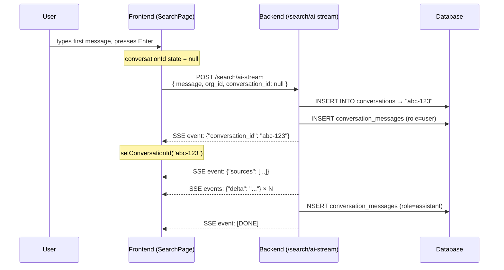
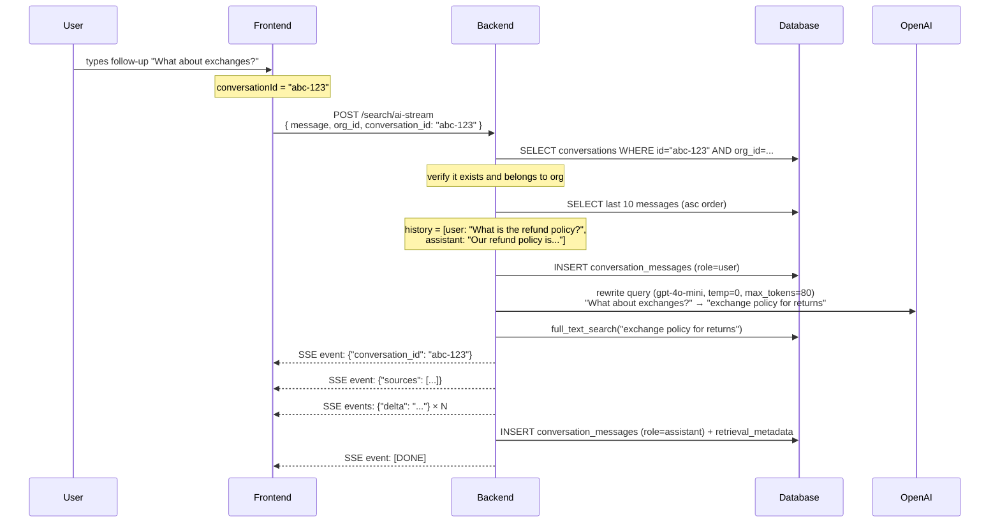
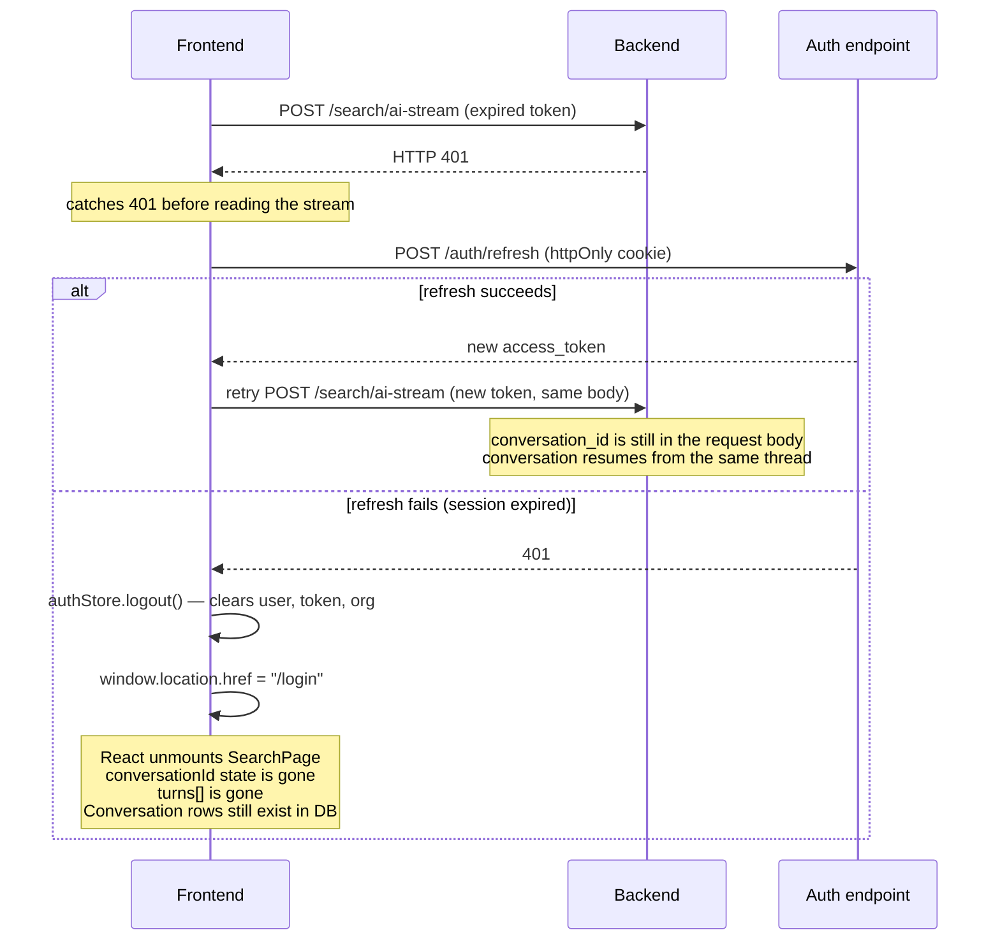
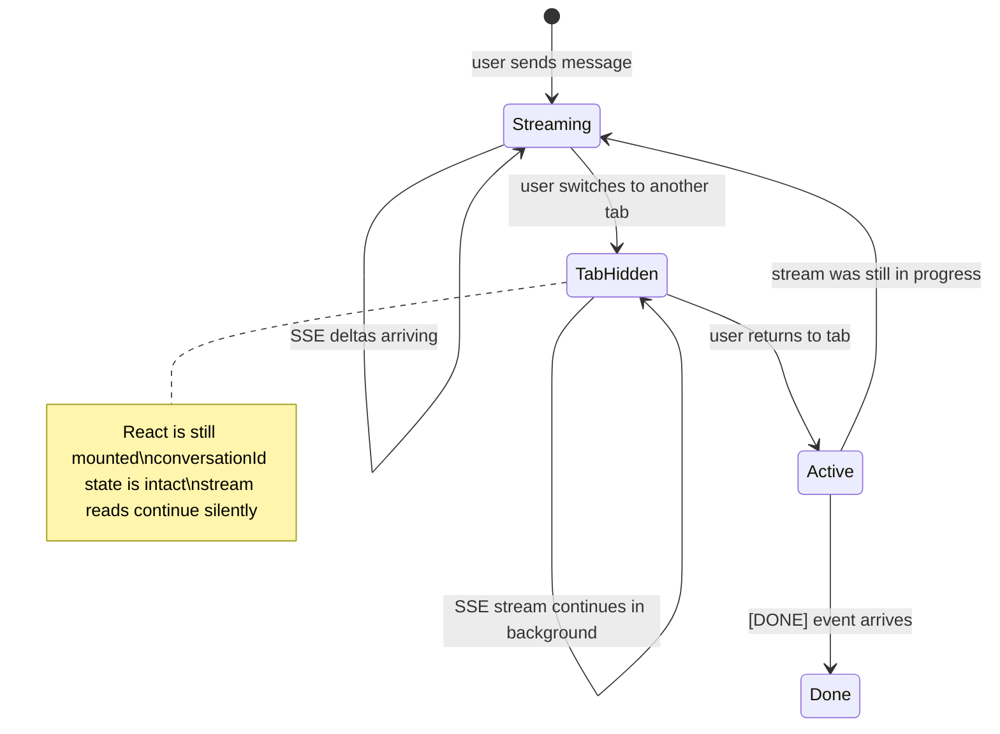
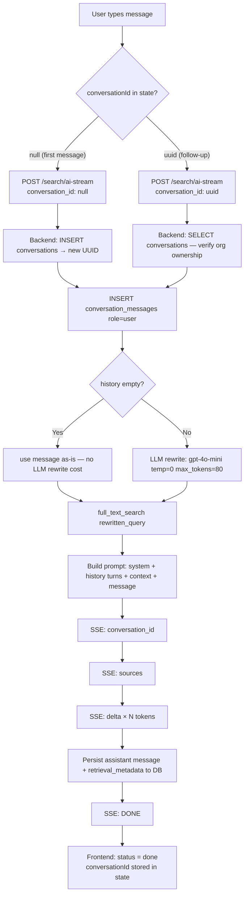

# Conversation Flow

Incharj's AI search is a stateful, multi-turn conversational RAG system. Every conversation is persisted on the backend — the frontend only carries a `conversation_id` in React component state.

## When is a conversation_id created?

A `conversation_id` does **not** exist until the very first message is sent. Here is the exact moment it is born:

1. User types a message and presses Enter.
2. Frontend calls `ask(message, null)` — `null` because no conversation exists yet.
3. The request reaches the backend with `conversation_id: null`.
4. `conversation_service.get_or_create()` sees `null`, runs `INSERT INTO conversations`, and returns a new UUID.
5. The UUID is the **very first SSE event** streamed back to the frontend: `{"conversation_id": "abc-123"}`.
6. The frontend's `useEffect` watches `streamState.conversationId` and writes it to `conversationId` state in `SearchPage`.
7. Every subsequent message sends that UUID back in the request body.



## Follow-up Messages

From the second message onwards the frontend sends the stored UUID. The backend loads history from the DB (never from the client), rewrites the query for context-aware retrieval, and builds the full prompt.



## Scenario: User logs out mid-stream

The access token has a short TTL. If it expires during a streaming request:



**What's preserved in the DB even after forced logout:**
- The `conversations` row exists.
- The user message sent just before the 401 was already persisted (step 3 of every request happens before retrieval).
- The assistant message may or may not be persisted — it's only written after the full LLM response is accumulated, before `[DONE]`. If the 401 cut off the stream early, the assistant turn is absent from history.

**What happens when the user logs back in:**
- New JWT, React state is fresh.
- `conversationId` state is `null` — there is no conversation picker or URL-based resume.
- The next message starts a new conversation (new UUID).
- Old conversations remain in the DB but the frontend does not surface them yet (no conversation history sidebar).

## Scenario: User switches tabs or navigates away



Switching tabs does **not** interrupt the stream. The browser keeps the SSE connection open, the `ReadableStream` reader continues consuming bytes, and `setState` updates continue in the background. When the user comes back, the answer is either still streaming or already complete.

**What if the user navigates away within the app** (e.g., goes to Connectors page)?

`SearchPage` unmounts. React discards all component state:

- `conversationId` → gone
- `turns[]` → gone
- The `AbortController` is not explicitly cancelled on unmount in the current implementation, but the browser will close the fetch connection when the component unmounts.

The backend's SSE generator detects the disconnected client (the async iteration stalls or errors) and stops. The **user message is already in DB**. The **assistant message is only in DB if** the LLM response was fully accumulated before the disconnect happened.

When the user returns to the Search page, `conversationId` starts at `null` — a fresh conversation begins.

## Scenario: User closes the tab mid-stream

Closing the tab is equivalent to navigating away: the browser closes the SSE connection. The backend generator eventually errors out. The user message is persisted; the assistant message likely is not (it's written only after full accumulation).

On the next visit to the app:

- `accessToken` is **not** in localStorage (the auth store deliberately excludes it from persistence for security).
- The user is sent to `/login`.
- After logging in, `conversationId` is `null` — new conversation.

## Lifetime of a conversation_id

| Event | conversationId in frontend | Conversation in DB |
|---|---|---|
| Page load / first visit | `null` | — |
| First message sent | `null` (pending) | Row created |
| First SSE event received | `"abc-123"` (stored in React state) | Exists |
| Follow-up message | `"abc-123"` (sent in request) | Exists, history loading |
| Tab switch | `"abc-123"` (React state intact) | Unchanged |
| Navigate away (within app) | Lost — component unmounts | Exists in DB |
| Token refresh (silent) | `"abc-123"` (preserved across retry) | Unchanged |
| Force logout (expired session) | Lost — authStore cleared, page reloads | Exists in DB, orphaned |
| "New conversation" button | Explicitly reset to `null` | Old conversation stays |
| Tab close / page reload | Lost — not in localStorage | Exists in DB |

## Where is the conversation_id stored?

| Location | Stored? | Notes |
|---|---|---|
| React component state (`useState`) | Yes | Source of truth during a session |
| `localStorage` / `sessionStorage` | No | Intentional — no resume on reload |
| URL / query params | No | Intentional — conversations are not shareable links |
| `authStore` (zustand persist) | No | Only `currentOrg` is persisted |
| Database (`conversations.id`) | Yes | Permanent, survives all frontend resets |

## Request / Response Cycle (detailed)



## Database Schema

### `conversations`

| Column | Type | Notes |
|---|---|---|
| `id` | UUID PK | |
| `org_id` | UUID FK | Scopes to org — enforced server-side |
| `user_id` | UUID FK nullable | Nullable for future anonymous search |
| `title` | VARCHAR(255) nullable | Reserved for auto-generated titles |
| `created_at` | TIMESTAMPTZ | |
| `updated_at` | TIMESTAMPTZ | |

### `conversation_messages`

| Column | Type | Notes |
|---|---|---|
| `id` | UUID PK | |
| `conversation_id` | UUID FK | CASCADE DELETE |
| `role` | VARCHAR(20) | `user` \| `assistant` |
| `content` | TEXT | |
| `created_at` | TIMESTAMPTZ | |
| `retrieval_metadata` | JSONB nullable | `{ sources, search_query, original_message }` |

## Design Decisions

### Backend owns history — never the frontend

If the frontend sent the full message list, a client could inject fake assistant messages, manipulate the context window, or inflate token costs. Loading from DB on every request costs one indexed query and eliminates all of that.

### conversation_id is React state, not URL or localStorage

Conversations are not shareable links. Persisting the ID in the URL would mean two browser tabs could race to extend the same conversation. Persisting in `localStorage` would mean a tab reload could resume a stale conversation the user may not intend. The current trade-off: conversations are session-scoped on the frontend. The history is safe in the DB; the frontend just doesn't surface a resume UI yet.

### Query rewriting only when there is history

On the first message there is nothing to rewrite. From the second message onwards, the retrieval layer has no idea what pronouns like "it" or "that" refer to. The rewrite makes follow-ups independently searchable. It is a separate non-streaming call (`max_tokens=80, temperature=0`) — fast and deterministic.

### User message persisted before retrieval

If retrieval or the LLM call fails, the user's message is already in DB. The conversation history is accurate even on partial failures and is available for analytics regardless of outcome.

### Assistant message persisted before `[DONE]`

The full response is accumulated in memory during streaming, written to DB, then `[DONE]` is sent. By the time the frontend marks the turn complete, the history is already correct for the next follow-up.

### conversation_id sent as first SSE event

The frontend does not know the new UUID until after the DB insert. Sending it as the first event means it is captured even if the user closes the tab mid-stream — the DB row exists and future messages could theoretically resume the thread.

### Token refresh retries preserve the conversation_id

When a 401 is returned, `useAIAnswer` retries the exact same request body, including the `conversationId` that was passed in. The conversation thread is not broken by a silent token refresh.

### 10-message history window

Covers 5 full turns — the practical depth of most knowledge-base conversations before users naturally start a new one. Keeps latency and cost predictable. A `summary_text` column is reserved on `conversations` for compressing older history into a summary instead of truncating it.

## File Map

```
apps/api/app/
  routes/search.py                 — POST /search/ai-stream endpoint
  services/conversation_service.py — get_or_create, load_history, add_message
  sql/conversations.py             — insert/select query helpers
  db/tables.py                     — conversations + conversation_messages tables
  sql/schema.py                    — DDL (runs on startup via DDL_INITIALIZE)

apps/web/src/
  hooks/useAIAnswer.ts             — ask(message, conversationId), extracts conversation_id from stream,
                                     handles 401 → refresh → retry preserving conversation_id
  pages/SearchPage.tsx             — tracks conversationId state, New conversation button,
                                     useEffect syncs streamState.conversationId into local state
  stores/authStore.ts              — accessToken NOT persisted to localStorage (security)
                                     logout() clears everything → conversation state is lost on reload
```
