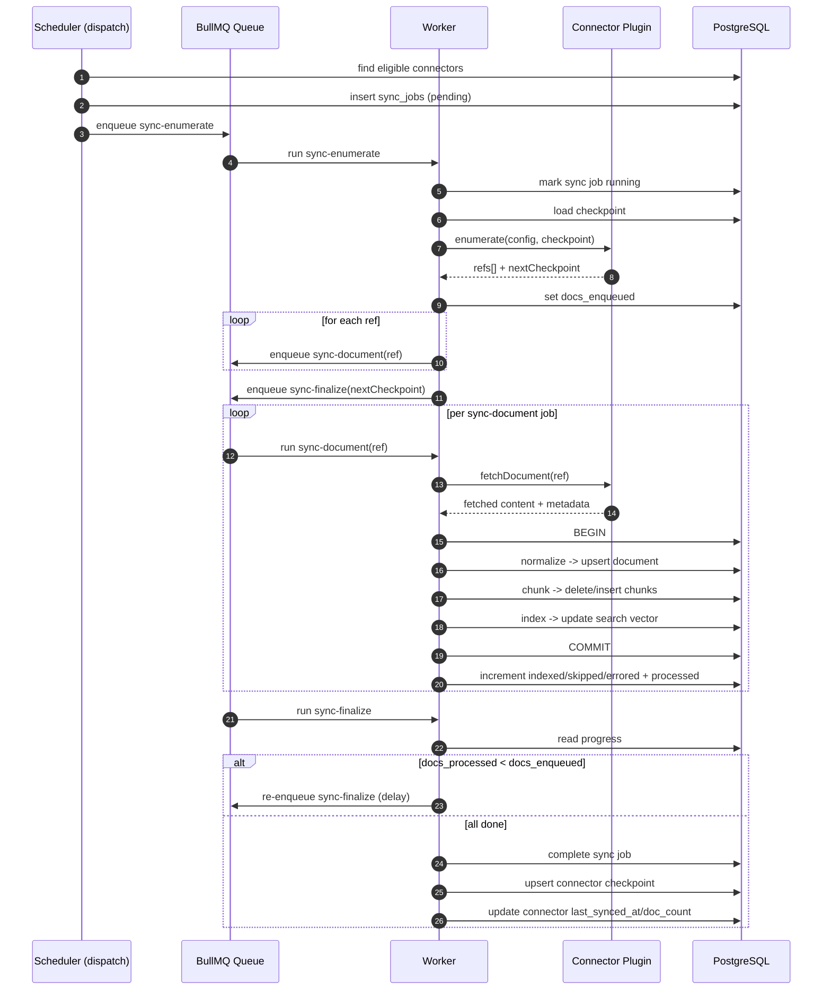

# Core: Orchestration

The orchestration layer coordinates the staged sync flow and job lifecycle.

Source modules:
- `backend/src/workers/scheduler.ts`
- `backend/src/workers/processor.ts`
- `backend/src/workers/index.ts`
- `backend/src/sql/sync-jobs.ts`

---

## Job topology

The worker runs one queue with three sync stages:

1. `sync-enumerate`:
   - Loads connector + credentials
   - Loads checkpoint from `connector_sync_state`
   - Calls `plugin.enumerate(...)`
   - Enqueues N `sync-document` jobs
   - Enqueues one `sync-finalize` job
2. `sync-document`:
   - Calls `plugin.fetchDocument(...)`
   - Builds a `CanonicalDocumentEnvelope`
   - Calls `ingestCanonicalDocument(...)`
   - Updates `docs_indexed/docs_skipped/docs_errored`
3. `sync-finalize`:
   - Polls progress until `docs_processed == docs_enqueued`
   - Completes sync job row
   - Persists checkpoint and credentials
   - Updates connector state (`last_synced_at`, `doc_count`)

Dispatching is done by a repeatable `dispatch` job every 30 seconds.

---

## Full flow (high-level and technical)

### High-level sequence

1. Schedule sync.
2. Enumerate refs.
3. Fetch one document at a time.
4. Ingest each fetched document immediately.
5. Finalize when all document jobs are processed.

This means the system does **not** fetch all full contents first and index later as one batch. It fetches and ingests per document.

### Technical sequence

1. `dispatch` tick runs `dispatchDueSyncs()`.
2. Eligible connector gets a `sync_jobs` row (`pending`) and one `sync-enumerate` job.
3. `sync-enumerate`:
   - marks job `running`
   - decrypts credentials
   - loads checkpoint from `connector_sync_state`
   - calls `plugin.enumerate(...)` and receives `refs[] + nextCheckpoint`
   - stores `docs_enqueued`
   - enqueues `sync-document` for each ref
   - enqueues delayed `sync-finalize`
4. Each `sync-document`:
   - calls `plugin.fetchDocument(...)`
   - builds `CanonicalDocumentEnvelope`
   - opens DB transaction and calls `ingestCanonicalDocument(...)`
   - commits/rolls back and increments outcome counters
5. `sync-finalize`:
   - reads progress from `sync_jobs`
   - requeues itself if `docs_processed < docs_enqueued`
   - completes sync job when ready
   - upserts connector checkpoint
   - updates connector sync metadata

### Sequence diagram



### Error behavior by stage

- Enumerate failure:
  - sync is failed early, no document jobs run.
- Document fetch/index failure:
  - retried per manifest retry policy.
  - on exhausted retries, counted as errored and sync continues.
- Finalize waits for all document jobs:
  - sync can complete with partial success if some docs errored.

### Job payload map

| Job name | Payload type | Purpose |
|---|---|---|
| `sync-enumerate` | `EnumerateJobData` | Start run, gather refs, enqueue downstream work |
| `sync-document` | `DocumentJobData` | Fetch + ingest one document |
| `sync-finalize` | `FinalizeJobData` | Close run and persist checkpoint/state |

---

## Typed job payloads

`processor.ts` defines strict payload contracts:

```ts
interface EnumerateJobData {
  syncJobId: string;
  connectorId: string;
}

interface DocumentJobData {
  syncJobId: string;
  connectorId: string;
  ref: ConnectorDocumentRef;
}

interface FinalizeJobData {
  syncJobId: string;
  connectorId: string;
  checkpoint: Record<string, unknown> | null;
  encryptedCredentials: string | null;
}
```

These payloads are the stage boundary contract.

---

## Failure and retry semantics

- `SyncPipelineError` carries:
  - `code`
  - `stage` (`enumeration | fetch | normalize | index | checkpoint`)
  - `retriable`
- Retries are governed by connector manifest retry policy:
  - `maxAttempts`
  - `backoffMs`
  - `strategy` (`fixed | exponential`)
- Non-retriable or exhausted failures are recorded as document errors and do not stop the whole sync.

---

## Why this split matters

- Enumerate stage is connector/network heavy.
- Document stage is content/DB heavy.
- Finalize stage is state consistency heavy.

By splitting them, each stage can scale, retry, and fail independently.
